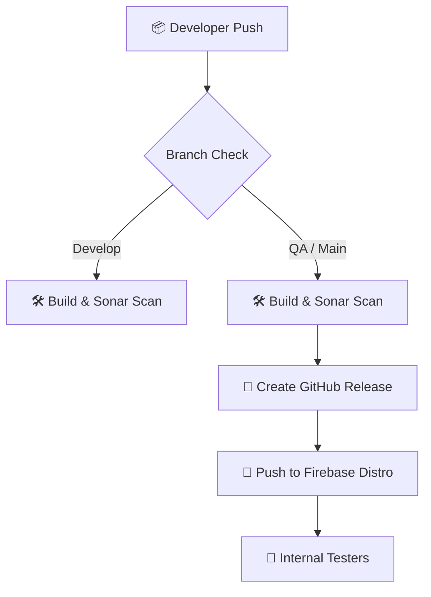

# 🚀 Android CI/CD Pipeline: Zero-Cost Automation


## 📌 Overview

This repository showcases a professional, **100% free** CI/CD pipeline for Android applications. It transforms a legacy project into a modern powerhouse that automatically scans, builds, stores, and delivers APKs.

### ✅ Key Features

- **Automated Builds** – Compiles Android apps with Gradle (JDK 11).
- **Code Quality Monitoring** – Automated analysis with **SonarCloud** (JDK 17).
- **Zero-Cost Storage** – Permanent APK hosting via **GitHub Releases**.
- **Resilient Distribution** – Direct delivery to testers via **Firebase CLI**.
- **Multi-branch Strategy** – CI on all branches, CD only on `qa` and `main`.

---

## 🏗️ Architecture



---

## 🛠️ Tech Stack

| Category | Technology |
|---|---|
| **CI/CD** | GitHub Actions |
| **Code Quality** | SonarCloud |
| **Artifact Storage** | GitHub Releases |
| **Distribution** | Firebase App Distribution (CLI) |
| **Build Tool** | Gradle |
| **Language** | Kotlin + Java |

---

## 📖 Success Guides

The entire journey and setup instructions are documented in these detailed guides:

1.  **[🚀 DevOps Journey](docs/devops-journey.md)** — How this project was transformed from legacy to modern.
2.  **[📱 Beginner's Handbook](docs/beginner-handbook.md)** — The "App Factory" explained for a non-technical audience.
3.  **[🆓 Provisioning Guide](docs/provisioning-guide.md)** — Step-by-step setup for a zero-cost pipeline.

---

## 🔐 Required Secrets

To replicate this setup, add these secrets to your GitHub repository (**Settings → Secrets and variables → Actions**):

| Secret | Description |
|---|---|
| `SONAR_TOKEN` | Auth token from SonarCloud |
| `SONAR_ORGANIZATION` | Your SonarCloud Org ID |
| `SONAR_PROJECT_KEY` | Your SonarCloud Project Key |
| `SONAR_HOST_URL` | SonarCloud host URL (use `https://sonarcloud.io`) |
| `FIREBASE_APP_ID` | Firebase Android App ID — format: `1:NUMBER:android:HEX` (find in Firebase Console → Project Settings → Your Apps) |
| `CREDENTIAL_FILE_CONTENT` | Full JSON content of the Firebase service account private key (generate from Firebase Console → Project Settings → Service Accounts → Generate new private key) |

---

## 🔥 Firebase Setup Requirements

Before the Firebase distribution step works, you must complete **all** of the following:

### 1. Register your Android app in Firebase
- Firebase Console → Project Settings → **Your Apps** → Add Android app
- The **package name must match** the `applicationId` in your `android-demo-app/app/build.gradle`
  ```groovy
  defaultConfig {
      applicationId "com.example.android_demo_app" // must match Firebase
  }
  ```

### 2. Grant IAM permissions to the service account
The auto-generated Firebase service account only has basic SDK permissions. You must add the **Firebase App Distribution Admin** role:
1. Go to [Google Cloud IAM Console](https://console.cloud.google.com/iam-admin/iam)
2. Find `firebase-adminsdk-fbsvc@<your-project-id>.iam.gserviceaccount.com`
3. Click ✏️ Edit → **Add another role** → `Firebase App Distribution Admin` → **Save**

### 3. Create the `internal-testers` group in Firebase
1. Firebase Console → **App Distribution** → **Testers & Groups** tab
2. Click **Add group** → name it exactly `internal-testers`
3. Add tester email addresses → **Save**

---

## 🛠️ Author

**Rafii Mafif** — DevOps Engineer
- 🐙 **GitHub**: [@rafiimafif](https://github.com/rafiimafif)

---

> ⭐ If you found this helpful, consider starring the repo!
